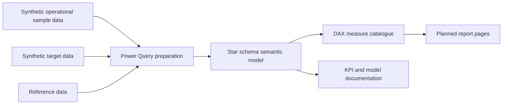

# Power BI KPI Semantic Model

[](https://github.com/quantameridian/powerbi-kpi-semantic-model/actions/workflows/ci.yml)
[](https://github.com/quantameridian/powerbi-kpi-semantic-model/actions/workflows/codeql.yml)
[](https://scorecard.dev/viewer/?uri=github.com/quantameridian/powerbi-kpi-semantic-model)
[](LICENSE)

## Project purpose

This repository is a Power BI semantic model and KPI design portfolio project for operational reporting.

It demonstrates the modelling work that should happen before dashboard visuals are built: sample data design, table grain, KPI definitions, target logic, DAX measure structure, report navigation planning, refresh assumptions, and handover notes.

No Power BI Desktop report artefact is included yet. There is no PBIP, PBIR, PBIX, report page, or screenshot in the current repository. That is intentional: those files should only be added after a real Power BI Desktop build exists and has been reopened, refreshed, and checked.

## Reviewer quick path

If you are reviewing this quickly, start here:

1. Read the current repository state table below.
2. Inspect `powerbi/semantic-model/model-contract.json` for the planned table, column, relationship, and measure contract.
3. Read `docs/validation-report.md` for the current automated validation result.
4. Read `docs/semantic-model-review-rubric.md` for the commercial review gates that are not yet passed.
5. Run `make qa` to validate JSON, CSV shapes, DAX catalogue references, review documents, and regenerate the validation report.

Harsh limitation: this is still not a finished Power BI build. A serious Power BI reviewer should treat it as a validated semantic-model plan until a real PBIP/TMDL artifact is added.

## Business problem

Operational reporting often grows from trackers, spreadsheet extracts, and dashboard pages where the KPI logic is difficult to inspect. A report can look polished but still be hard to trust if users cannot see:

- what each KPI means;
- which records are included or excluded;
- whether the same definition is used across pages;
- how targets are applied;
- which team or service owns the result;
- what caveats apply before the numbers are used in a review meeting.

This project frames a semantic model for a generic service or operations team that needs a consistent way to review workload, timeliness, backlog, service quality, target performance, and reporting-data readiness.

## What this project demonstrates

- Power BI semantic model thinking before visual design.
- Star-schema planning for operational KPI reporting.
- Safe synthetic sample data for fact, target, and reference inputs.
- KPI dictionary with business meaning, formula, grain, owner, interpretation, limitation, and data-quality risk.
- DAX measure catalogue grouped into core, quality, and trend measures.
- Report navigation plan based on management review questions.
- Refresh, validation, ownership, change-control, and handover approach.
- Honest artefact boundaries where no Power BI report file exists yet.

## Current repository state

| Area | Current evidence |
| --- | --- |
| Sample data | Synthetic CSV files in `data/` |
| Data dictionary | `docs/data-dictionary.md` |
| Model design | `docs/model-design.md` |
| KPI dictionary | `docs/kpi-dictionary.md` |
| DAX catalogue | `measures/core-measures.dax`, `measures/quality-measures.dax`, `measures/trend-measures.dax` |
| DAX explanation | `docs/dax-measures.md` |
| Model contract | `powerbi/semantic-model/model-contract.json` |
| Automated validation report | `docs/validation-report.md` |
| Semantic model review rubric | `docs/semantic-model-review-rubric.md` |
| Report navigation plan | `docs/report-navigation.md` |
| Refresh and handover plan | `docs/refresh-and-handover.md` |
| Power BI build QA checklist | `docs/powerbi-build-qa-checklist.md` |
| Power BI artefact plan | `powerbi/README.md` |
| Theme draft | `theme/report-theme.json` |
| Power BI Desktop artefacts | Not included yet |
| Screenshots | Not included yet |

## Intended audience

Primary readers:

- reporting leads responsible for KPI packs;
- analytics engineers designing reusable reporting models;
- Power BI developers who need clear measure and model definitions;
- decision-support or assurance teams checking whether report logic is traceable.

Secondary readers:

- hiring reviewers looking for evidence of semantic modelling, DAX structure, KPI ownership, governance thinking, and handover discipline;
- service managers who need to understand what sits behind a reliable operational report.

## Management questions

The planned model supports practical review questions:

- How much work is open, closed, overdue, or paused?
- Which service areas or owner groups carry the largest backlog?
- Are high-priority items being resolved within target?
- Which categories create the most work or longest cycle times?
- Are KPI results improving or deteriorating over time?
- Which results are affected by missing owner, target, due date, category, or evidence fields?
- Which measures need review before the output is used in a formal pack?

## Architecture

Current design route:



The diagram is the intended build route. It is not a claim that a Power BI Desktop model or report page currently exists.

## Data and sample-data provenance

The repository includes safe synthetic, non-client sample data:

| File | Purpose | Rows |
| --- | --- | ---: |
| `data/sample-operational-data.csv` | Operational work-item data | 32 |
| `data/sample-targets.csv` | Category/priority target thresholds | 16 |
| `data/sample-reference-data.csv` | Reference values for dimensions | 27 |

The data represents generic operational reporting records only: service area, owner role, status, priority, opened date, closed date, due date, category, evidence state, review flag, and target threshold.

No real client data, protected workplace data, official internal material, or copied reporting documents should be introduced.

## Model design

The planned model is a small star schema:

- `fact_operational_item`: one row per work item;
- `fact_target`: one row per target key and threshold;
- dimensions for date, service area, owner, category, status, and priority;
- DAX measures for workload, timeliness, target performance, data readiness, risk, and trend.

See `docs/model-design.md` for table grain, relationship assumptions, and boundaries.

## KPI and DAX catalogue

The KPI dictionary defines the business meaning and interpretation of each measure. The DAX catalogue provides draft measures that map to the planned semantic model.

The DAX files are intentionally plain text so they can be reviewed in GitHub. The repository validator checks that measure definitions and table-column references are consistent with the model contract. They have not yet been validated inside Power BI Desktop because the Power BI model has not been built.

## How to use this repository

There is no Power BI Desktop command to run because no Power BI project file exists yet. There is, however, a repository validation command:

```bash
make qa
```

Recommended review path:

1. Read `docs/model-design.md` to understand the planned star schema.
2. Review `docs/kpi-dictionary.md` for KPI meaning, ownership, formulas, and risks.
3. Inspect the DAX files in `measures/`.
4. Read `docs/dax-measures.md` for measure grouping and validation notes.
5. Review `docs/report-navigation.md` and `docs/refresh-and-handover.md` to understand how a future report should be built, refreshed, governed, and handed over.
6. Review `docs/powerbi-build-qa-checklist.md` and `docs/semantic-model-review-rubric.md` before treating the repository as an implemented Power BI model.

Manual Power BI Desktop build steps are documented in `powerbi/README.md` and `docs/refresh-and-handover.md`.

## Outputs

Current outputs:

- synthetic sample data;
- data dictionary;
- fact/dimension model design;
- KPI dictionary;
- DAX measure catalogue;
- DAX explanation document;
- source-controlled model contract;
- automated validation report;
- semantic-model review rubric;
- report navigation plan;
- refresh and handover plan;
- Power BI Desktop build QA checklist;
- Power BI artefact plan;
- public-readiness audit.

Not included:

- PBIP, PBIR, PBIX, or Tabular Editor files;
- report pages;
- screenshots;
- claims of live deployment, formal approval, or production use.

## Tests and quality checks

There is an automated repository validation suite, but it does not replace Power BI Desktop validation.

Current quality checks:

- sample data is synthetic and non-client;
- KPI definitions are documented before visuals;
- DAX measures are separated into reviewable files;
- JSON theme syntax is validated;
- source CSV headers and row counts are checked against the model contract;
- DAX measure definitions are checked against the contract;
- DAX table-column references are checked against the planned table contract;
- review and limitation documents are checked for key hard-stop language;
- docs state clearly that no Power BI artefact exists yet;
- screenshots are prohibited until generated from a real report build.

Security posture, Power BI artifact boundaries, and public-data rules are documented in [docs/security-posture.md](docs/security-posture.md).

The next validation step is Power BI Desktop testing of table names, data types, relationships, and DAX syntax.

## Commercial relevance

This repo demonstrates the part of Power BI work that is often missed in portfolio examples: defining the model, measures, ownership, target logic, caveats, and refresh responsibilities before arranging visuals.

It is intended to show semantic modelling judgement and reporting governance thinking, not dashboard decoration.

## Limitations

- The repository is currently a semantic-model proof and DAX catalogue, not a finished Power BI report.
- DAX has not been validated in Power BI Desktop.
- No screenshots or Power BI project artefacts are included.
- The data is synthetic and simplified.
- Manual build steps remain before this becomes a working Power BI report.

See `docs/limitations.md` for the full limitation statement.

## Next improvements

1. Build the model in Power BI Desktop from the repository CSV files.
2. Validate relationships, data types, and DAX measures against the sample rows.
3. Run Tabular Editor Best Practice Analyzer or equivalent semantic-model review.
4. Save a valid Power BI Project only after it opens and refreshes correctly.
5. Add screenshots only after they are generated from the actual report.
