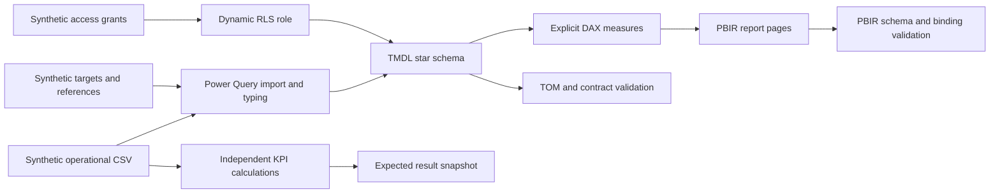

# Operations KPI Power BI Model

[](https://github.com/quantameridian/powerbi-kpi-semantic-model/actions/workflows/ci.yml)
[](https://github.com/quantameridian/powerbi-kpi-semantic-model/actions/workflows/codeql.yml)
[](https://scorecard.dev/viewer/?uri=github.com/quantameridian/powerbi-kpi-semantic-model)
[](LICENSE)

This repository contains a source controlled Power BI project for an operational service review. It follows work from opening through closure, applies category and priority targets, and keeps reporting risk visible beside the performance numbers.

The model is deliberately small enough to inspect. Its value is in the parts that usually become difficult to review once a report grows: table grain, date behaviour, target eligibility, DAX denominators, access filtering and release evidence.

## Current State

| Artifact | Evidence |
| --- | --- |
| Power BI project | [`powerbi/OperationsKPI.pbip`](powerbi/OperationsKPI.pbip) points to the report and local semantic model |
| Semantic model | 11 TMDL tables, 31 explicit measures, 10 relationships and one dynamic RLS role |
| Report | Two PBIR pages with 10 bound visuals, using current visual types rather than legacy cards or tables |
| Automated validation | Microsoft TOM deserialises the TMDL; Microsoft’s PBIR CLI validates the report; Python reconciles the source and expected KPI results |
| Desktop acceptance | Still required on Windows for open, refresh, role simulation and rendered page review |
| Screenshots | Not published until the Desktop acceptance run has produced evidence from this exact commit |

## Business Context

A service manager needs to know how much work is open, what is overdue, whether completed work met its service target and whether the underlying records are fit for review. Those questions become unreliable when target definitions sit in visual filters, closure dates are mixed with opened dates, or incomplete records disappear from the headline numbers.

This project keeps the rules in the semantic model. The report can then answer two conversations:

- The **Executive Summary** shows current workload, historical backlog, completions, overdue work and SLA performance.
- **Assurance Detail** shows missing ownership, missing due dates, missing closure evidence and the records behind those warnings.

The sample is fixed at 30 June 2026 so that every clean run produces the same result.

## Architecture


```mermaid
flowchart LR
    A["Synthetic operational CSV"] --> Q["Power Query import and typing"]
    T["Synthetic targets and references"] --> Q
    S["Synthetic access grants"] --> R["Dynamic RLS role"]
    Q --> M["TMDL star schema"]
    R --> M
    M --> D["Explicit DAX measures"]
    D --> P["PBIR report pages"]
    M --> V["TOM and contract validation"]
    P --> W["PBIR schema and binding validation"]
    A --> C["Independent KPI calculations"]
    C --> E["Expected result snapshot"]
```

The active date relationship is `Date[Date]` to `Operational Item[Opened Date]`. Due and closed dates use inactive relationships. Measures that report completions activate the closed date path and disable the opened date path, which prevents the same date filter from constraining both events.

Historical backlog is reconstructed from opened and closed dates. Current backlog uses current status. Keeping both measures avoids presenting a current state count as if it were a historical snapshot.

## Repository Map

```text
powerbi/
  OperationsKPI.pbip
  OperationsKPI.SemanticModel/definition/  TMDL model, role and relationships
  OperationsKPI.Report/definition/         PBIR pages and visual bindings
data/                                      Synthetic source and access records
contracts/                                 Machine readable model and report contract
docs/                                      Model, KPI, security and operating notes
scripts/                                   Source checks and reference calculations
tests/                                     Reviewed KPI result snapshot
tools/tmdl-validator/                      Microsoft TOM deserialisation gate
theme/                                     Versioned report theme source
```

## Run The Checks

The validation toolchain needs Node.js 20 or later and .NET 8. Python uses only the standard library.

```bash
make install
make qa
```

`make qa` runs five independent gates:

1. Unit tests compare the sample data with [`tests/expected-kpis.json`](tests/expected-kpis.json).
2. The repository validator checks CSV contracts, keys, references, model objects, report bindings, documentation and security fixtures.
3. Microsoft TOM deserialises the complete TMDL folder.
4. Microsoft’s Power BI report authoring CLI validates PBIR schemas, visual roles, layout and theme registration.
5. The evidence report is regenerated at [`docs/validation-report.md`](docs/validation-report.md).

CI also fails when the generated evidence differs from the committed copy.

## Reference Results

These values are independently calculated from the CSVs. They are not exported from Power BI and therefore do not substitute for the Desktop acceptance test.

| Measure | Expected result |
| --- | ---: |
| Total items | 32 |
| Current open items | 14 |
| Current backlog, including paused work | 16 |
| Overdue active items | 14 |
| Closed items with valid SLA inputs | 13 |
| SLA met items | 9 |
| SLA met rate | 69.2% |
| Weighted SLA target | 82.1% |
| Records with a readiness issue | 7 |
| Data readiness rate | 78.1% |

The sample intentionally misses its weighted SLA target and contains incomplete records. A clean data story would make a weak assurance example.

## Engineering Evidence

The strongest technical evidence is in the source rather than the prose:

| Concern | Where it is implemented |
| --- | --- |
| Star schema and date paths | [`relationships.tmdl`](powerbi/OperationsKPI.SemanticModel/definition/relationships.tmdl) |
| Explicit measures and format strings | [`Measures.tmdl`](powerbi/OperationsKPI.SemanticModel/definition/tables/Measures.tmdl) |
| Typed, portable sample imports | [`expressions.tmdl`](powerbi/OperationsKPI.SemanticModel/definition/expressions.tmdl) |
| Dynamic service area access | [`Service Area Manager.tmdl`](powerbi/OperationsKPI.SemanticModel/definition/roles/Service%20Area%20Manager.tmdl) |
| Report bindings and layout | [`OperationsKPI.Report`](powerbi/OperationsKPI.Report) |
| KPI regression evidence | [`reference_kpis.py`](scripts/reference_kpis.py) and [`expected-kpis.json`](tests/expected-kpis.json) |
| Release checks | [`validate_powerbi_assets.py`](scripts/validate_powerbi_assets.py) and [CI](.github/workflows/ci.yml) |

For a short technical review, follow [`docs/reviewer-guide.md`](docs/reviewer-guide.md). The model’s operating assumptions are in [`docs/model-design.md`](docs/model-design.md), and the KPI definitions are in [`docs/kpi-dictionary.md`](docs/kpi-dictionary.md).

## Open In Power BI Desktop

Power BI Desktop project support and TMDL are preview features, so use a current Windows installation and enable the relevant preview options if prompted.

1. Open `powerbi/OperationsKPI.pbip`.
2. Confirm the `GitHubRawBaseUrl` parameter points to the intended branch or fork.
3. Refresh all queries.
4. Follow [`docs/desktop-acceptance-test.md`](docs/desktop-acceptance-test.md), including the two RLS identity checks.
5. Save only after the refresh and expected value reconciliation are clean.

The default query parameter reads the public `main` branch through HTTPS. This keeps the project portable and avoids local machine paths. A controlled deployment should replace that source with an approved storage layer and credentials managed outside the project files.

## Design References

The implementation follows Microsoft guidance for [Power BI Desktop projects](https://learn.microsoft.com/en-us/power-bi/developer/projects/projects-overview), [TMDL source control](https://learn.microsoft.com/en-us/power-bi/developer/projects/projects-dataset), [PBIR report definitions](https://learn.microsoft.com/en-us/power-bi/developer/projects/projects-report), [star schema design](https://learn.microsoft.com/en-us/power-bi/guidance/star-schema) and [row level security](https://learn.microsoft.com/en-us/power-bi/guidance/rls-guidance).

## Limits

The data is synthetic and does not establish production scale, query folding, gateway behaviour, tenant deployment, capacity performance or access enforcement in the Power BI service. The PBIP source passes format and contract checks, but a Windows Desktop run is still needed before this commit can claim rendered output or refresh acceptance. See [`docs/limitations.md`](docs/limitations.md) for the full boundary.
