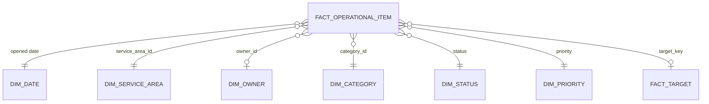

# Model Design

## Design intent

The intended model is a small Power BI semantic model for operational KPI reporting. It should show how to organise a management reporting model so KPI logic is inspectable, reusable, and not hidden inside visuals.

This document describes the model design and sample-data route. No Power BI Desktop model, PBIP folder, or PBIX file currently exists in this repository.

The source-controlled contract for the planned model is maintained in
`powerbi/semantic-model/model-contract.json`. It is validated by
`scripts/validate_powerbi_assets.py`, but it is not a substitute for a real
Power BI Desktop semantic model.

## Reporting concept

The report represents a generic service or operations function managing a queue of work items. Each item has an owner, service area, category, priority, status, due date, and possible closure date. The report should help managers review demand, backlog, timeliness, target performance, and reporting-data readiness.

The model should support repeatable management review rather than one-off analysis. Measures should be named clearly, grouped by topic, and traceable back to documented KPI definitions.

## Data files

| File | Model role | Grain |
| --- | --- | --- |
| `data/sample-operational-data.csv` | Source for `fact_operational_item` | One row per operational item |
| `data/sample-targets.csv` | Source for `fact_target` or `dim_target` depending on implementation choice | One row per category/priority target key |
| `data/sample-reference-data.csv` | Source for small dimensions | One row per reference value |

## Intended model shape

Planned star schema:

## Planned tables

| Table | Type | Planned grain | Purpose |
| --- | --- | --- | --- |
| `fact_operational_item` | Fact | One row per operational item | Workload, backlog, timeliness, priority, status, and lifecycle measures |
| `fact_target` | Fact or narrow target table | One row per category, priority, and reporting period where applicable | Target comparison for SLA or service thresholds |
| `dim_date` | Dimension | One row per calendar date | Trend, due-date, opened-date, and closed-date analysis |
| `dim_service_area` | Dimension | One row per service area/reporting unit | Management grouping and ownership |
| `dim_owner` | Dimension | One row per owner or owner role | Ownership and accountability analysis |
| `dim_category` | Dimension | One row per work category | Workload and target grouping |
| `dim_status` | Dimension | One row per allowed status | Consistent status grouping and report filters |
| `dim_priority` | Dimension | One row per allowed priority | Sorting and high-priority grouping |

## Fact and Dimension Mapping

| Model table | Source fields | Key | Notes |
| --- | --- | --- | --- |
| `fact_operational_item` | All operational item fields except descriptive reference labels | `item_id` | Keeps lifecycle dates, status, priority, target key, evidence state, and review flag |
| `fact_target` | Target file fields | `target_key` | Used for target days, target rate, and coverage measures |
| `dim_service_area` | Reference rows where `reference_type = "service_area"` | `reference_id` | Joins to `service_area_id` |
| `dim_owner` | Reference rows where `reference_type = "owner"` | `reference_id` | Joins to `owner_id`; relationship should allow blank owners |
| `dim_category` | Reference rows where `reference_type = "category"` | `reference_id` | Joins to `category_id` |
| `dim_status` | Reference rows where `reference_type = "status"` | `reference_id` | Joins to `status` |
| `dim_priority` | Reference rows where `reference_type = "priority"` | `reference_id` | Joins to `priority` |
| `dim_date` | Generated in Power Query or DAX during the Power BI build | `date` | Should cover January to June 2026 at minimum for current sample |

## Relationship principles

- Use single-direction relationships from dimensions to facts unless Power BI Desktop validation proves a specific exception is needed.
- Keep one active relationship between `dim_date` and the primary reporting date. Additional date relationships, such as due date or closed date, should be handled intentionally with DAX or role-playing date tables.
- Avoid many-to-many relationships in the first implementation.
- Avoid calculated columns for logic that belongs in Power Query or the source sample data.
- Keep targets separate from operational items so target definitions can be reviewed independently.
- Allow blank owner and due-date values to remain visible so readiness measures can detect them.

## Planned relationship paths

| From | To | Relationship | Expected filter direction |
| --- | --- | --- | --- |
| `dim_service_area[service_area_id]` | `fact_operational_item[service_area_id]` | One-to-many | Single |
| `dim_owner[owner_id]` | `fact_operational_item[owner_id]` | One-to-many, with blanks in fact | Single |
| `dim_category[category_id]` | `fact_operational_item[category_id]` | One-to-many | Single |
| `dim_status[status]` | `fact_operational_item[status]` | One-to-many | Single |
| `dim_priority[priority]` | `fact_operational_item[priority]` | One-to-many | Single |
| `fact_target[target_key]` | `fact_operational_item[target_key]` | One-to-many or dimension-style target lookup | Single |
| `dim_date[date]` | `fact_operational_item[opened_date]` | One-to-many active date path | Single |

Due date and closed date should be tested as inactive relationships, role-playing date tables, or explicit DAX filter logic during the Power BI Desktop build. The choice should be documented once the Power BI model exists.

## Planned measure groups

| Measure group | Purpose |
| --- | --- |
| Core workload | Counts of open, closed, new, paused, and backlog items |
| Timeliness | Overdue counts, due-soon counts, cycle time, ageing |
| Target performance | SLA met rate, target coverage, variance to target |
| Data readiness | Missing owner, missing due date, missing category, missing target, missing evidence |
| Risk and priority | High-priority open, high-priority overdue, priority-weighted backlog |
| Trend | Period movement, rolling averages, month-on-month change |

## Model boundaries

The semantic model should answer management questions, not become a data-quality engine, warehouse model, or full process architecture pack.

Boundary decisions:

- Data quality indicators may be included as Power BI measures, but detailed exception-register generation belongs in the `operational-data-quality-engine` repo.
- SQL/dbt transformation modelling belongs in the `analytics-engineering-service-mart` repo.
- Architecture operating-model guidance belongs in the `decision-support-architecture-playbook` repo.
- This repo focuses on Power BI semantic modelling, DAX logic, report structure, refresh assumptions, and handover.

## Validation approach for the Power BI build

Power BI Desktop implementation should check:

- table grains match the documentation;
- relationships behave as expected in Power BI Desktop;
- DAX measures match the KPI dictionary;
- totals and filtered views are explainable;
- targets are applied only where a valid target row exists;
- screenshots, if added, match the actual report state.

Repository validation before the Desktop build should check:

- source CSV headers and row counts match the model contract;
- DAX measure names match the contract;
- DAX table-column references point to planned model columns;
- the theme JSON remains valid.
