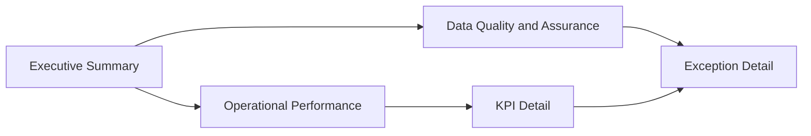

# Report Navigation

## Purpose

This document defines the planned report navigation for the Power BI KPI semantic model project. It is a build plan only. No report pages, screenshots, PBIP files, or PBIR files are claimed to exist yet.

The report should demonstrate how a reviewer would move from management-level KPI status to the underlying operational records and data quality context.

## Navigation principles

- Start with the management questions, not the visuals.
- Keep the page set small enough for review and handover.
- Make KPI definitions traceable to the semantic model and DAX measures.
- Separate performance interpretation from data quality checks.
- Do not add screenshots until they are generated from the actual report.

## Planned page structure

| Page | Purpose | Primary audience | Planned content |
| --- | --- | --- | --- |
| 1. Executive Summary | Show current KPI status and exceptions requiring attention | Senior reviewer or service lead | KPI cards, target variance, key trend, open exception count, data quality warning |
| 2. Operational Performance | Explain service volume, timeliness, backlog, and throughput | Operational manager or analyst | trend chart, service/team breakdown, backlog profile, SLA or timeliness measure |
| 3. KPI Detail | Show how each KPI is calculated and segmented | Analyst or report owner | KPI table, period comparison, target comparison, filterable service/team view |
| 4. Data Quality and Assurance | Show whether the report data is ready for use | Report owner or assurance lead | missing owner count, invalid status count, stale records, records missing evidence |
| 5. Exception Detail | Provide row-level review support | Analyst or action owner | record table with owner, status, risk, due date, review date, evidence flag, issue type |

## Planned report flow

## Page design notes

### Executive Summary

The first page should answer:

- Are key KPIs above or below target?
- Which KPI needs attention first?
- Is the underlying data quality acceptable for reporting?
- Are any high-risk exceptions unresolved?

The page should avoid dense diagnostic detail. It should direct the reviewer to the relevant detail page.

### Operational Performance

This page should show operational movement over time and explain whether changes are driven by volume, timeliness, backlog, or service mix. It should use a small number of visuals with clear axis titles and consistent filters.

### KPI Detail

This page should make KPI logic visible. It should support checking a KPI by period, service area, and team. It should connect to `docs/kpi-dictionary.md` and the measure files in `measures/`.

### Data Quality and Assurance

This page should make reporting risk visible. It should show where data quality issues may affect interpretation, especially missing owners, missing evidence, invalid statuses, and stale records.

### Exception Detail

This page should support follow-up action. It should prioritise rows by risk, due date, and quality issue type.

## Navigation controls to build manually

When the report is created in Power BI Desktop:

- Add a page navigator or consistent left-side navigation.
- Use page names that match this document.
- Keep slicers consistent across pages where possible.
- Add drill-through only if it helps move from KPI summary to exception detail.
- Avoid hidden pages unless they are clearly documented.

## Screenshot policy

Screenshots should only be added to `powerbi/screenshots/` after:

- the report has been created in Power BI Desktop;
- visuals use the sample data in this repository;
- the screenshots match the current report build;
- the README and this document describe the same page structure.

