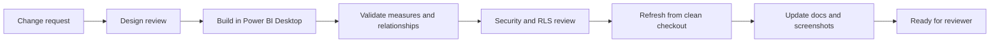

# Semantic Model Change Control

## Purpose

This document defines how KPI, model, DAX, relationship, and report navigation
changes should be controlled once a real Power BI artifact exists.

The repo currently contains a validated model plan and DAX catalogue. It does
not contain a PBIP, TMDL, PBIX, or deployed semantic model.

## Change Types

| Change type | Example | Required review |
| --- | --- | --- |
| KPI definition | Change SLA denominator or exclusion rule | KPI owner and reporting lead |
| DAX measure | Rewrite `[SLA Met Rate]` logic | BI owner and KPI owner |
| Relationship | Change filter direction or active date path | BI owner and model reviewer |
| Source field | Rename or remove source CSV column | Data owner and BI owner |
| Target logic | Change target threshold or effective date | KPI owner and service owner |
| RLS/access | Add role or change security bridge mapping | Access approver and assurance reviewer |
| Report navigation | Add page, remove page, or change drillthrough route | Reporting owner |

## Review Gates

| Gate | Evidence required |
| --- | --- |
| Design review | Change reason, affected KPIs, affected tables, owner approval |
| Build review | PBIP/TMDL or model artifact updated and reopened successfully |
| Measure review | DAX evaluates in Power BI Desktop and matches KPI dictionary |
| Security review | RLS/access impact reviewed where applicable |
| Regression review | Existing headline values compared before and after change |
| Publication review | README, screenshots, and limitations updated after validation |

## Change Record Fields

| Field | Purpose |
| --- | --- |
| Change ID | Stable reference for review and handover |
| Requested by | Role or forum requesting the change |
| Change type | KPI, DAX, relationship, source, target, RLS, report, or documentation |
| Description | Plain language explanation |
| Business reason | Why the change is needed |
| Affected artifacts | Measures, tables, pages, screenshots, docs, or contracts |
| Approval owner | Role accountable for accepting the change |
| Implementation owner | Role accountable for making the change |
| Test evidence | Desktop refresh, DAX validation, role test, or repository validation |
| Effective date | Reporting period where the change applies |
| Restatement decision | Whether historic results are restated or marked not comparable |

## Promotion Model

## Current Limitation

This repo can validate documentation, CSV shapes, JSON, and DAX references. It
cannot validate Power BI Desktop behavior until a real model artifact is added.
